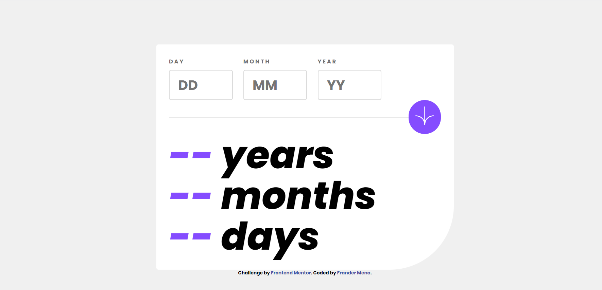
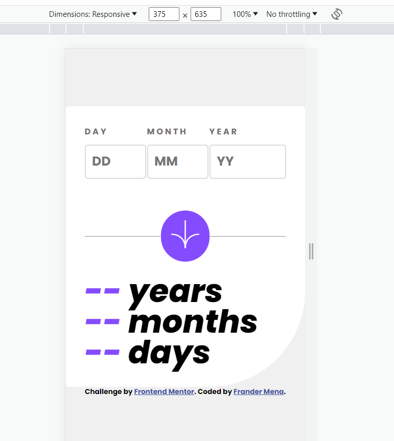
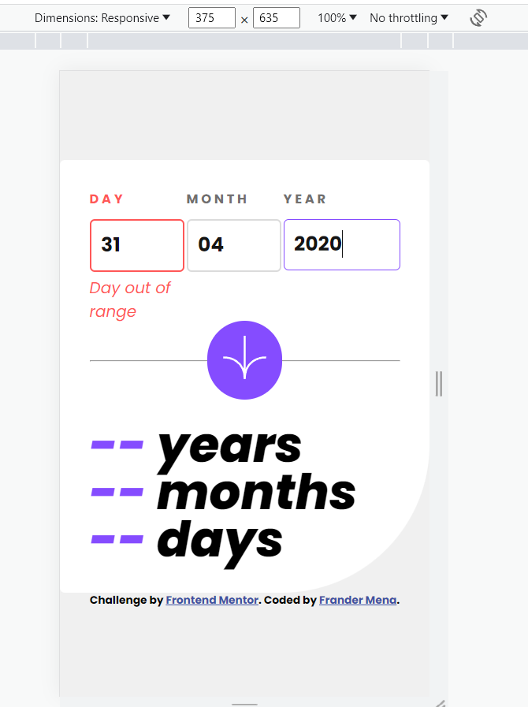

# Frontend Mentor - Age calculator app solution

This is a solution to the [Age calculator app challenge on Frontend Mentor](https://www.frontendmentor.io/challenges/age-calculator-app-dF9DFFpj-Q). Frontend Mentor challenges help you improve your coding skills by building realistic projects. 

## Table of contents

- [Overview](#overview)
  - [The challenge](#the-challenge)
  - [Screenshot](#screenshot)
  - [Links](#links)
- [My process](#my-process)
  - [Built with](#built-with)
  - [What I learned](#what-i-learned)
  - [Continued development](#continued-development)
  - [Useful resources](#useful-resources)
- [Author](#author)
- [Acknowledgments](#acknowledgments)

**Note: Delete this note and update the table of contents based on what sections you keep.**

## Overview

### The challenge

Users should be able to:

- View an age in years, months, and days after submitting a valid date through the form
- Receive validation errors if:
  - Any field is empty when the form is submitted
  - The day number is not between 1-31
  - The month number is not between 1-12
  - The year is in the future
  - The date is invalid e.g. 31/04/1991 (there are 30 days in April)
- View the optimal layout for the interface depending on their device's screen size
- See hover and focus states for all interactive elements on the page
- **Bonus**: See the age numbers animate to their final number when the form is submitted

### Screenshot

### Links

- Solution URL: [Add solution URL here](https://age-calculator-frander.netlify.app/)

## My process

### Built with

- Semantic HTML5 markup
- CSS custom properties
- Flexbox
- Mobile-first workflow
### What I learned

The practice for the resolution of logical problems, was a exelent exercise in which cases such as leap days should be taken into account, or if the date was greater with respect to the number of days and months

With vanilla javascript learn to do the validations without the help of bootstrap

### Continued development

The use of flexbox and grid and minimize the use of media queries. Using the position absolute is another utility that I must learn to take advantage of.

### Useful resources

- [Youtube - Channel](https://www.youtube.com/@YoelvisM) - This helped me for understanding of flexbox and grid
- [W3 School](https://www.w3schools.com/) - The entire documentation for CSS elementes
- [Javascript - Age Calculation](https://linuxhint.com/javascript-age-calculation/#:~:text=In%20JavaScript%2C%20the%20built%2Din,date%20to%20perform%20this%20task.): A hint for the solution

## Author

- Website - [Mi curriculum page](https://frander-cv.netlify.app/)
- Github - [JosephMen](https://github.com/JosephMen)

## Acknowledgments

When laying out a design it is very difficult for everything to look the same in a single attempt. It is much more profitable to copy the structure, then the choice of colors, paddings and margins becomes easier, and avoid using static heights and widths.

Do not forget to test all the cases for the solution of the exercise

## Solution section

To calculate the number of days to the present, there are several considerations, these are the most important:
-The difference in years must be a variable dependent on the difference between the month entered and the current month.
-If the current month is greater than the one entered, then a year has not passed, which we must subtract from the difference in years.
-If the current month is less than the month entered then we must count how much until December and then add the number of the current month.
-Each previous case must also consider the cases, submitted day and current day. Which of the 2 is greater and how will we do the subtraction?

With this reasoning we do not need to know if there were leap years.

Example of an expected behavior.
- Current date: 7/31/2023
- Submitted date: 12/31/2022
- Expected output: 31 days, 6 months, 0 years.

Although the entered date begins a day before the new year and the current one is called month 7, not exactly 7 months have passed, but every time there is an end of the month, 31 days are fulfilled until the next day. turns one month This is because we are adding continuity to the months measure.

